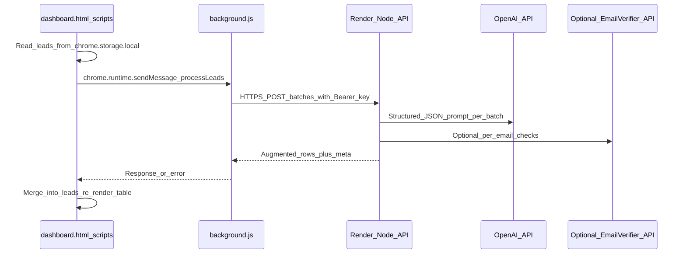

# Render-backed AI lead quality + Sheets export

## Product framing (ship honestly)

- **“More emails / more accurate”**: combine (a) **deterministic rescoring** of addresses already present in bio/website fields, (b) optional **LLM-assisted rescue** when multiple candidates exist or email field is empty but text suggests one, (c) optional **third-party verification** later—not magic “find hidden emails.”
- **“Investigate each one”**: implement as **batched checks** with clear statuses: syntax/disposable-domain/role-account (local), optional **external verifier** (API), optional **LLM consistency check** (does email match name/brand signals). Show **reason codes** in the dashboard.
- **“Demographics / psychographics”**: in UI and prompts, label outputs as **signal-based segments** (e.g. `creator_signals`, `local_business_signals`, `b2b_domain`) with **confidence**—avoid implying census-grade demographics from IG bios alone.

## Architecture

- **Why use [`background.js`](background.js) as proxy**: avoids CORS pain for `chrome-extension://` pages calling your Render origin; centralizes outbound fetch and timeouts; keeps dashboard JS simpler.
- **Auth model (your choice)**: single **`MEGALEADS_API_KEY`** on Render; same key ships with the extension via **gitignored** config (see below)—acceptable for an MVP private build; rotate if leaked.

## Render service (new code in repo)

- Add a **`server/`** Node service (Express or Fastify) with:
  - `GET /health` for Render health checks.
  - `POST /v1/leads/enrich` (name can vary): accepts JSON `{ leads: LeadDTO[], options?: { verify?: boolean, llm?: boolean } }`, returns `{ leads: LeadDTO[] }` with **additive fields** only (do not drop usernames).
  - **Middleware**: `Authorization: Bearer <MEGALEADS_API_KEY>` required; reject missing/invalid with 401.
  - **Limits**: body size cap, max rows per request (e.g. 50–100), simple in-memory rate limit optional.
  - **Logging**: avoid logging full emails at info level; redact or hash if needed.
- **Processing pipeline (server)**:
  1. **Deterministic email hygiene** (port or share logic with [`scripts/selectors.js`](scripts/selectors.js) `pickBestEmail` / junk-domain rules—today the richer rules live in [`content/chunk-01-constants-dom-contacts.js`](content/chunk-01-constants-dom-contacts.js); prefer extracting a **small shared module** under `scripts/email-quality.js` imported by both dashboard-side tooling and `server/` via duplication kept in sync OR duplicate minimally in server with a comment “keep aligned with selectors.js”).
  2. **LLM step (batched)**: for each batch, send compact DTOs `{ username, followerCount, bio, websiteUrl, email, phone }` and ask for **strict JSON** output array aligned by `username` with fields like `segment_primary`, `segment_tags[]`, `email_suggested`, `email_action` (`keep|replace|clear`), `email_confidence_0_1`, `notes` (short). Use `response_format`/JSON schema if using OpenAI SDK.
  3. **Optional verification step**: if `EMAIL_VERIFICATION_API_KEY` set, call provider for `verify` path; map to `email_deliverability` enum. If unset, skip and document cost/latency tradeoff.

- **Render deploy**: `render.yaml` optional; otherwise document “Web Service, Node start command `node server/index.js`, health check `/health`”.

## Extension changes

### 1) Messaging + background proxy

- Extend [`scripts/constants.js`](scripts/constants.js) `MSG` with e.g. `LF_LEADS_REMOTE_ENRICH`.
- In [`background.js`](background.js): handle message → `fetch(process.env...)` **not available in SW**; read **static import** from new gitignored config module **or** read URL/key from `chrome.storage.local` if you prefer not rebuilding (still single-key). For MVP aligned to your choice: **gitignored `scripts/leadflow-remote-config.js`** exporting `{ apiBaseUrl, apiKey }`, imported by background only.
- Timeouts (e.g. 60s), size guard, surface readable errors back to dashboard.

### 2) Dashboard UI + merge logic

- [`dashboard.html`](dashboard.html): add a compact **“AI: clean & segment”** panel: options toggles (LLM on/off, verify on/off if available), progress text, primary button.
- [`scripts/dashboard.js`](scripts/dashboard.js): chunk leads (e.g. 40 rows), call background message, merge returned fields into stored leads (`STORAGE_KEYS.LEADS`), then `renderTable()` / export buttons reflect new columns.
- [`scripts/i18n.js`](scripts/i18n.js): Italian/English strings for the new panel, statuses, errors.

### 3) Optional table columns

- Add columns or a detail drawer for `segment_primary`, `email_deliverability`, `email_action`—keep table width sane (maybe show segment + icon, full detail on hover/title).

## “Open in Google Sheets” (MVP that is honest + useful)

- **Phase 1 (recommended now)**: button **“Open Google Sheets”** that:
  1. Triggers your existing CSV/XLSX export path (reuse [`scripts/dashboard.js`](scripts/dashboard.js) export helpers) **or** generates a UTF‑8 CSV string in memory.
  2. Downloads the file (user gets `leadflow-...csv`).
  3. Opens `https://docs.google.com/spreadsheets/u/0/create` (or `https://sheets.new`) in a new tab.
  4. Shows a short localized hint: **File → Import → Upload** (true one-click import requires OAuth or a service account writing to Drive—Phase 2).

- **Phase 2 (later, larger)**: Google OAuth or service-account sheet creation—additional Render env + consent screen; not required for first competitive slice.

## Repo hygiene for the shared API key

- Commit **`scripts/leadflow-remote-config.example.js`** with placeholders.
- Add **`scripts/leadflow-remote-config.js`** to `.gitignore`.
- Document: “Copy example → `leadflow-remote-config.js` before loading unpacked / building zip; value must match Render `MEGALEADS_API_KEY`.”

## Testing checklist (you run after deploy)

- Render `/health` OK.
- Extension: small list (5 rows) then 200 rows; verify batching + merge.
- Toggle verify off/on (if provider configured).
- Italian UI strings.

---

## Render / extension environment variables (your setup list)

**On Render (Web Service environment):**

| Variable | Required | Purpose |
|----------|----------|---------|
| `PORT` | Auto-set by Render | Listen port (use `process.env.PORT \|\| 3000`). |
| `NODE_ENV` | Recommended | `production`. |
| `MEGALEADS_API_KEY` | **Yes** | Bearer token the extension must send. |
| `OPENAI_API_KEY` | **Yes** (if LLM enabled) | Model calls for segmentation + email rescue JSON. |
| `OPENAI_MODEL` | Optional | Default e.g. `gpt-4o-mini` (cost/latency knob). |
| `EMAIL_VERIFICATION_API_KEY` | Optional | If you integrate a verifier vendor. |
| `EMAIL_VERIFICATION_PROVIDER` | Optional | e.g. `zerobounce` / `neverbounce` / custom base URL key. |
| `LEADFLOW_MAX_LEADS_PER_REQUEST` | Optional | Safety cap (default 75). |
| `LEADFLOW_LOG_LEVEL` | Optional | `info` / `warn` / `error`. |

**In the extension (local file `scripts/leadflow-remote-config.js`, not Render):**

| Variable / export | Required | Purpose |
|-------------------|----------|---------|
| `apiBaseUrl` | **Yes** | `https://your-service.onrender.com` |
| `apiKey` | **Yes** | Must match Render `MEGALEADS_API_KEY` |

**Optional later (Phase 2 Google Sheets API):** `GOOGLE_CLIENT_ID`, `GOOGLE_CLIENT_SECRET`, `GOOGLE_REFRESH_TOKEN` or service account JSON—only if you implement server-side sheet creation.
